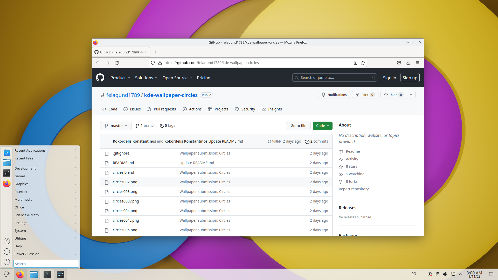
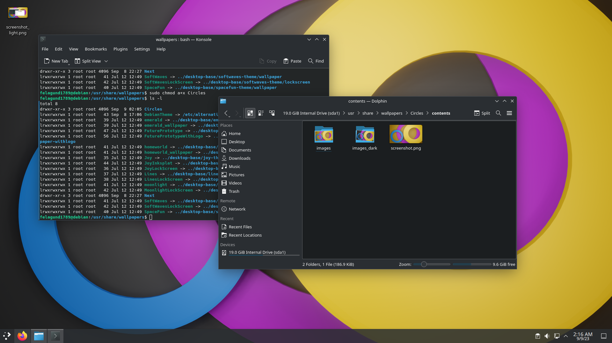
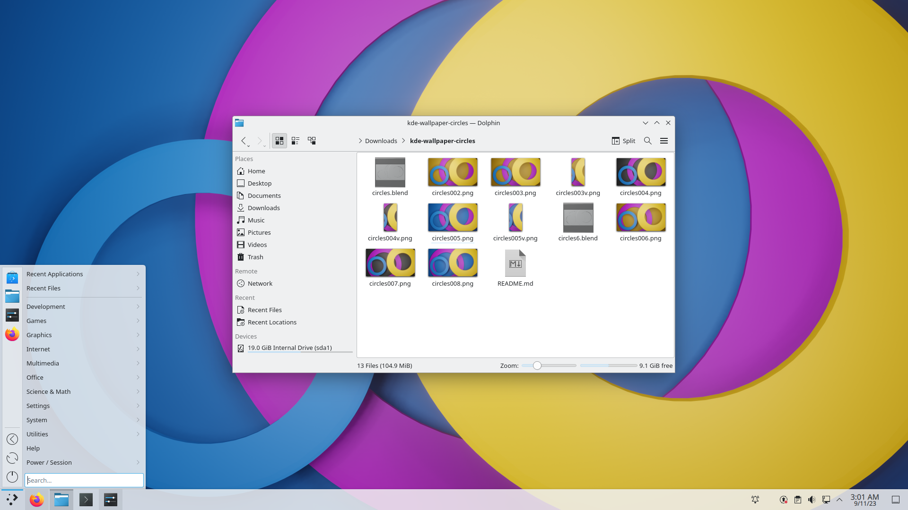

# Wallpaper Submission: Circles
## For the KDE Plasma 6.0 Wallpaper Competition

Hi All,

This is my first submission for this competition. The wallpaper collection is named Circles, which I think is... appropriate :-).

The wallpapers are created using Blender. I initially created a light mode version (yellowish orange) and a dark mode version (dark grey), but I thought something was missing so I also created a KDE blue version of the wallpaper.

I think that it fits the description of being abstract and that it can start a design trend for the following Plasma 6 versions. In addition, I think that the circle can be associated with being stable and dependable as well as familiar and comfortable.

This is how they look in KDE Plasma.

Finally, here are the corresponding vertical versions of the wallpapers:

  

I hope you like my wallpapers :-)