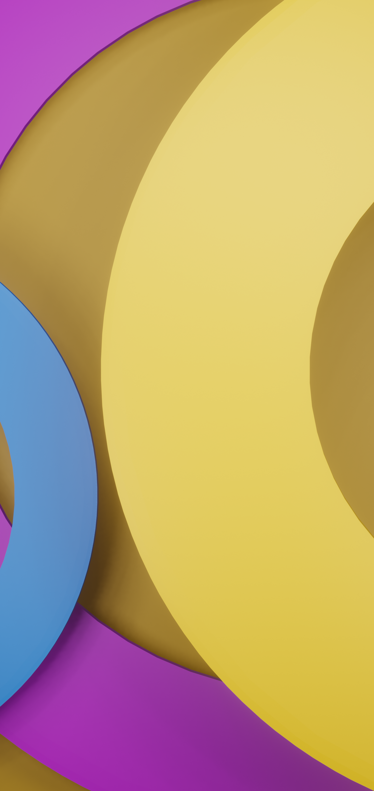
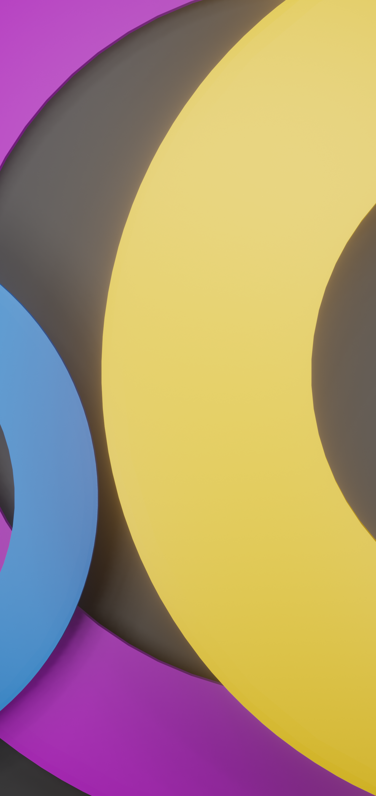
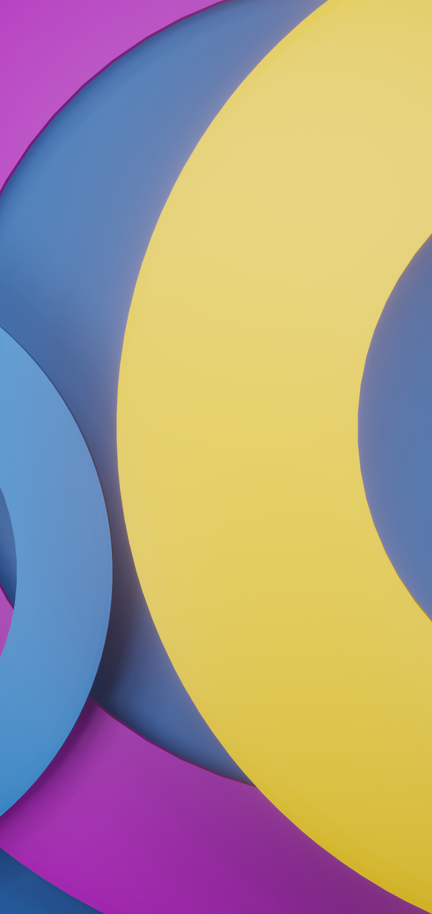

# Wallpaper Submission: Circles
## For the KDE Plasma 6.0 Wallpaper Competition

Hi All,

This is my first submission for this competition. The wallpaper collection is named Circles, which I think is… appropriate :-).

The wallpapers are created using Blender. I initially created a light mode version (yellowish orange) and a dark mode version (dark grey), but I thought something was missing so I also created a KDE blue version of the wallpaper.

I think that it fits the description of being abstract and that it can start a design trend for the following Plasma 6 versions. In addition, I think that the circle can be associated with being stable and dependable as well as familiar and comfortable.

Finally, here are the corresponding vertical versions of the wallpapers:

  

I hope you like my wallpapers :-)